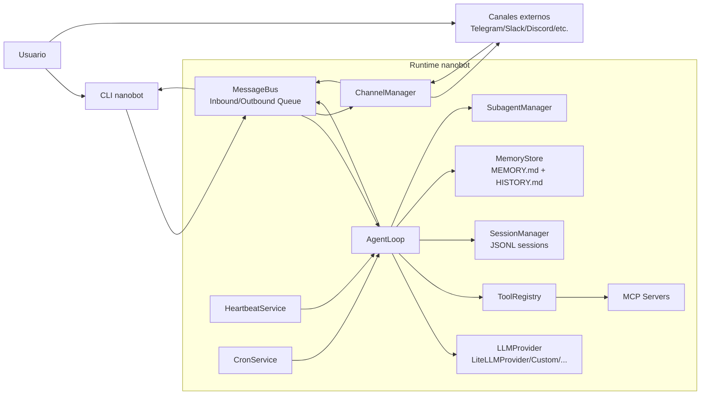

# Arquitectura del sistema (con Mermaid)

## Visión general

La arquitectura está centrada en un **núcleo agéntico asíncrono** (`AgentLoop`) conectado a:

- **Entradas/salidas** multicanal (`ChannelManager` + canales concretos).
- **Proveedor LLM** abstracto (`LLMProvider`) con implementación principal `LiteLLMProvider`.
- **Herramientas (tools)** registradas dinámicamente (`ToolRegistry`).
- **Persistencia conversacional y memoria** (`SessionManager` + `MemoryStore`).
- **Servicios programados** (`CronService`, `HeartbeatService`, subagentes).

## Diagrama de arquitectura (Mermaid)

## Capas lógicas

1. **Interfaz**: CLI y canales.
2. **Transporte interno**: `MessageBus` desacopla productores/consumidores.
3. **Orquestación**: `AgentLoop` coordina contexto, iteraciones LLM y tools.
4. **Capacidades**: Tools locales (fs, shell, web, cron, message, spawn, mcp).
5. **Persistencia**: sesiones y memoria consolidada.
6. **Servicios auxiliares**: heartbeat y cron para ejecución autónoma.

## Decisiones de diseño relevantes

- **Abstracción de proveedor**: `LLMProvider` unifica contrato para múltiples backends.
- **Registro de providers**: `providers/registry.py` concentra metadata de enrutado.
- **Historia append-only**: optimiza consistencia del contexto y simplifica trazabilidad.
- **Consolidación periódica**: evita crecimiento indefinido del prompt manteniendo memoria útil.

