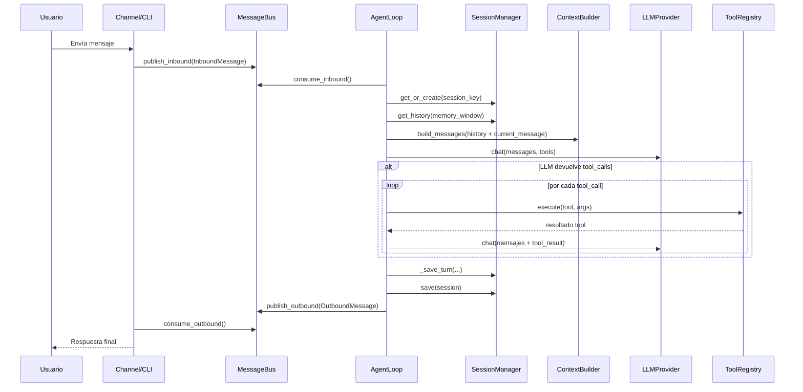
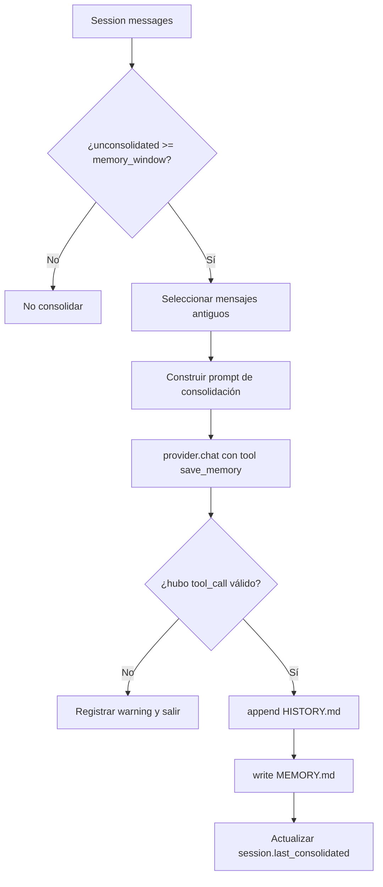
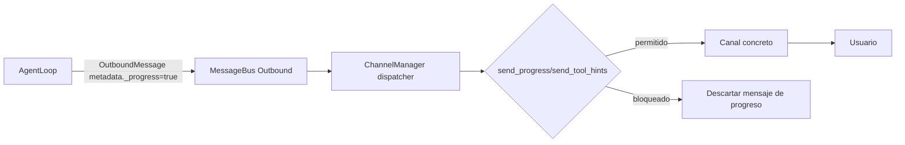
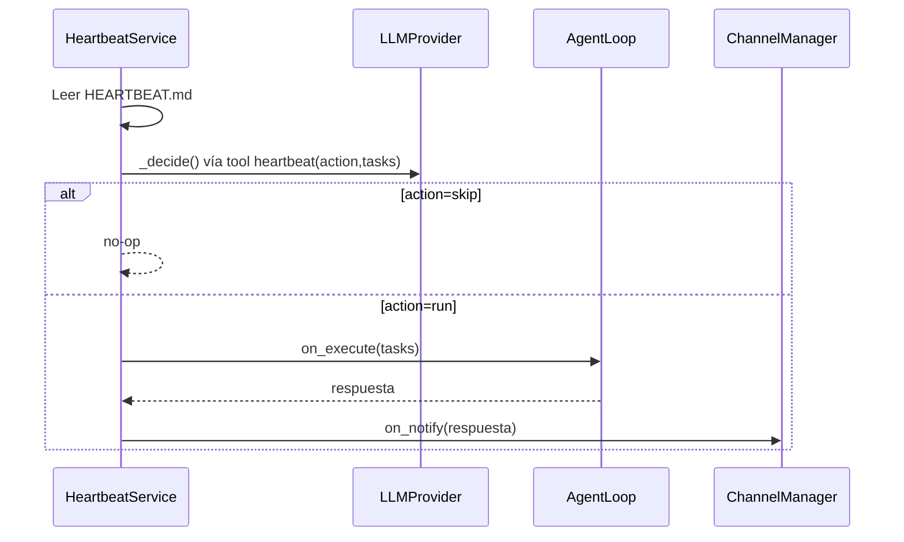

# Flujos de datos del sistema (con Mermaid)

## 1) Flujo principal: mensaje entrante hasta respuesta

## 2) Flujo de consolidación de memoria

## 3) Flujo de salida y streaming de progreso

## 4) Flujo de heartbeat

## Observaciones de flujo

- El diseño tolera errores de tools devolviendo strings de error con hint de reintento.
- El loop de tools está acotado por `max_iterations` para evitar ciclos infinitos.
- El canal de progreso es opcional y configurable por `channels.send_progress` y `channels.send_tool_hints`.

