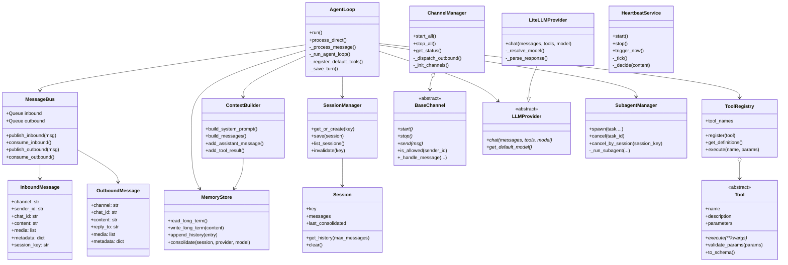

# Diagrama de clases y relaciones (Mermaid)

## Diagrama principal de clases

## Notas de diseño OO

- **`AgentLoop`** actúa como *application service* principal.
- **`Tool` y `BaseChannel`** definen contratos de extensión (polimorfismo).
- **`LLMProvider`** permite intercambiar backend sin tocar orquestación.
- **`ToolRegistry`** elimina dependencias rígidas y facilita composición de capacidades.

