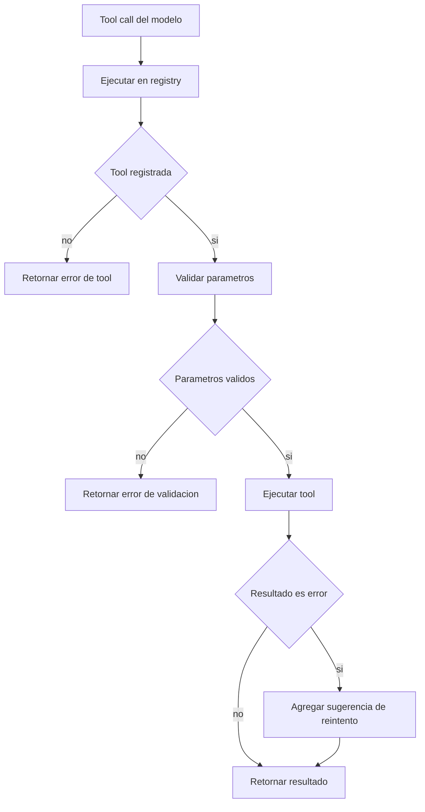
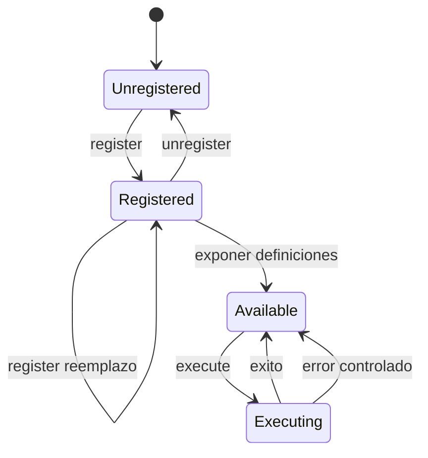
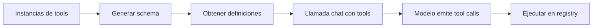

# Módulo: ToolRegistry

## Objetivo

`ToolRegistry` centraliza registro, descubrimiento y ejecución de herramientas (`Tool`) usadas por el agente durante tool-calling.

Es una capa de desacople entre:

- el orquestador (`AgentLoop`),
- y las implementaciones concretas (filesystem, shell, web, cron, message, spawn, MCP, etc.).

---

## Modelo base: `Tool`

Toda herramienta hereda de `Tool` y debe definir:

- `name`
- `description`
- `parameters` (JSON Schema)
- `execute(**kwargs)` asíncrono

La clase base aporta:

- `validate_params(params)`: validación contra schema.
- `_validate(...)`: validación recursiva para `object`, `array`, tipos escalares, `enum`, rangos y límites de longitud.
- `to_schema()`: conversión al formato function-calling esperado por providers.

Esto garantiza consistencia de contrato y reduce errores de integración.

---

## Capacidades de `ToolRegistry`

## 1) Gestión de ciclo de vida

- `register(tool)`: alta/reemplazo por `tool.name`.
- `unregister(name)`: baja segura (sin error si no existe).
- `get(name)`: recuperación opcional.
- `has(name)`, `__contains__`, `__len__`, `tool_names` para introspección.

## 2) Exposición a LLM

- `get_definitions()` devuelve lista de schemas serializados de todas las tools registradas.
- Esa lista se pasa en cada llamada `provider.chat(..., tools=...)`.

## 3) Ejecución robusta

`execute(name, params)` implementa flujo defensivo:

1. Verifica existencia de tool.
2. Valida parámetros según schema.
3. Ejecuta `await tool.execute(**params)`.
4. Si resultado textual empieza por `Error`, añade hint para reintento inteligente.
5. Si hay excepción Python, devuelve error textual capturado.

El hint común (`[Analyze the error above and try a different approach.]`) mejora auto-corrección del agente en iteraciones siguientes.

---

## Contratos y convenciones

- Los errores de ejecución se devuelven como texto (no se relanzan) para que el LLM pueda razonar y ajustar llamadas.
- La validación ocurre antes de invocar la tool concreta, reduciendo errores evitables.
- El registro es simple diccionario en memoria, priorizando velocidad y simplicidad.

---

## Integración típica

En runtime, `AgentLoop`:

1. Registra tools por defecto al inicializar.
2. Entrega `registry.get_definitions()` al provider.
3. Para cada tool call del modelo, invoca `registry.execute(...)`.
4. Inserta el resultado como mensaje role `tool` en el historial del turno.

Así, `ToolRegistry` actúa como frontera uniforme entre decisión del modelo y side-effects reales en sistema/entorno.

---

## Diagramas

## 1) Flujo de ejecucion de tool call

## 2) Maquina de estados de tool en registry

## 3) Flujo de contratos hacia provider

