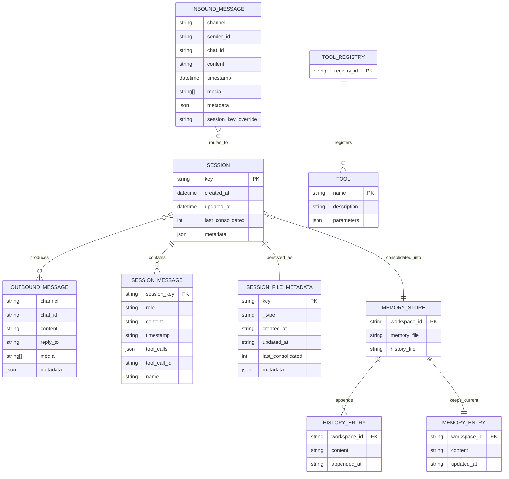

# Diccionario de Datos y ERD

## Objetivo

Definir entidades, atributos, relaciones y cardinalidades relevantes del runtime de `nanobot`, tomando como fuente el código y la documentación ya generada.

---

## Diccionario de datos

## 1) InboundMessage

Representa un evento de entrada desde canales externos.

| Campo | Tipo | Requerido | Descripción |
|---|---|---:|---|
| `channel` | `str` | Sí | Canal lógico de origen (telegram, discord, etc). |
| `sender_id` | `str` | Sí | Identificador del remitente. |
| `chat_id` | `str` | Sí | Identificador de chat o room. |
| `content` | `str` | Sí | Texto del mensaje. |
| `timestamp` | `datetime` | No | Fecha/hora de recepción. |
| `media` | `list[str]` | No | Referencias de medios asociados. |
| `metadata` | `dict[str, Any]` | No | Datos específicos del canal. |
| `session_key_override` | `str or None` | No | Clave opcional para forzar scope de sesión. |
| `session_key` | `property` | Derivado | `session_key_override` o `channel:chat_id`. |

## 2) OutboundMessage

Representa una salida hacia canales externos.

| Campo | Tipo | Requerido | Descripción |
|---|---|---:|---|
| `channel` | `str` | Sí | Canal de destino. |
| `chat_id` | `str` | Sí | Chat de destino. |
| `content` | `str` | Sí | Contenido de respuesta. |
| `reply_to` | `str or None` | No | Referencia opcional para reply. |
| `media` | `list[str]` | No | Medios a enviar. |
| `metadata` | `dict[str, Any]` | No | Metadatos de entrega. |

## 3) Session

Unidad de persistencia conversacional por `session_key`.

| Campo | Tipo | Requerido | Descripción |
|---|---|---:|---|
| `key` | `str` | Sí | Clave lógica de sesión `channel:chat_id`. |
| `messages` | `list[dict]` | Sí | Historial append only de mensajes. |
| `created_at` | `datetime` | Sí | Fecha de creación de sesión. |
| `updated_at` | `datetime` | Sí | Última actualización. |
| `metadata` | `dict[str, Any]` | No | Metadatos libres de sesión. |
| `last_consolidated` | `int` | Sí | Índice de corte consolidado a memoria. |

### Campos frecuentes dentro de `messages[]`

| Campo | Tipo | Requerido | Descripción |
|---|---|---:|---|
| `role` | `str` | Sí | `user`, `assistant`, `tool`, `system`. |
| `content` | `str or list` | Sí | Texto o bloques multimodales. |
| `timestamp` | `str` | No | Marca temporal ISO. |
| `tool_calls` | `list[dict]` | No | Tool calls emitidas por assistant. |
| `tool_call_id` | `str` | No | Correlación de resultado de tool. |
| `name` | `str` | No | Nombre de tool en mensajes role tool. |

## 4) SessionMetadataLine JSONL

Primera línea de cada archivo `sessions/*.jsonl`.

| Campo | Tipo | Requerido | Descripción |
|---|---|---:|---|
| `_type` | `str` | Sí | Valor fijo `metadata`. |
| `key` | `str` | Sí | Clave de sesión. |
| `created_at` | `str` | Sí | Fecha ISO de creación. |
| `updated_at` | `str` | Sí | Fecha ISO de actualización. |
| `metadata` | `dict` | No | Metadatos de sesión. |
| `last_consolidated` | `int` | Sí | Índice consolidado. |

## 5) Tool

Contrato base para herramientas registradas.

| Campo | Tipo | Requerido | Descripción |
|---|---|---:|---|
| `name` | `str` | Sí | Nombre único de la tool. |
| `description` | `str` | Sí | Descripción funcional. |
| `parameters` | `dict` | Sí | JSON Schema de parámetros. |
| `execute` | `async callable` | Sí | Implementación de ejecución. |

## 6) ToolRegistry

Registro en memoria de tools.

| Campo | Tipo | Requerido | Descripción |
|---|---|---:|---|
| `_tools` | `dict[str, Tool]` | Sí | Mapa de herramientas activas. |

## 7) Memory artifacts

Archivos de memoria en `workspace/memory`.

| Artefacto | Tipo | Descripción |
|---|---|---|
| `MEMORY.md` | Markdown | Estado de memoria de largo plazo vigente. |
| `HISTORY.md` | Markdown | Registro cronológico append only de consolidaciones. |

---

## ERD lógico

---

## Notas

- El ERD es conceptual y mezcla entidades en memoria con artefactos persistidos para facilitar entendimiento integral.
- `SESSION_MESSAGE` y `SESSION_FILE_METADATA` corresponden al modelo JSONL y no a una base relacional física.
