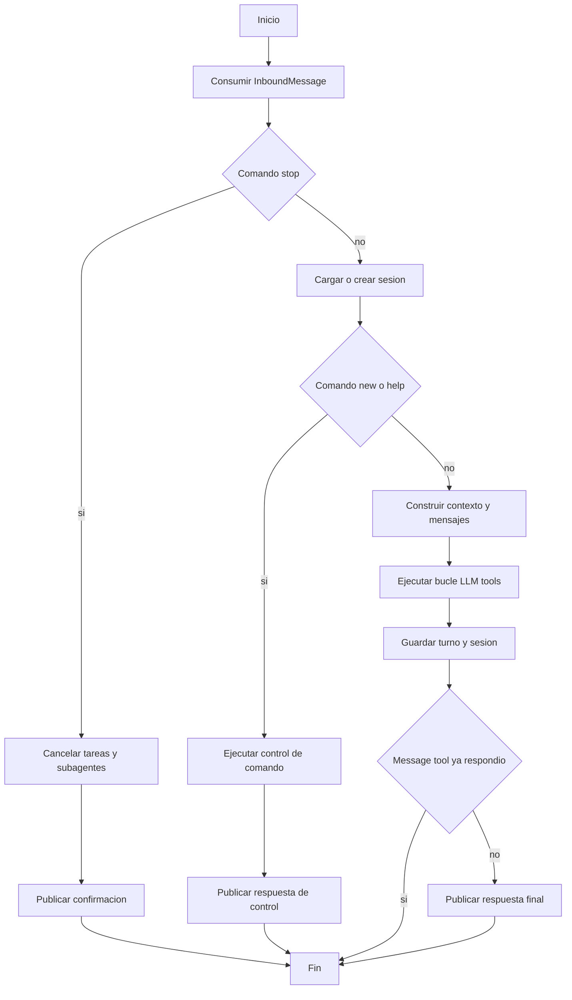
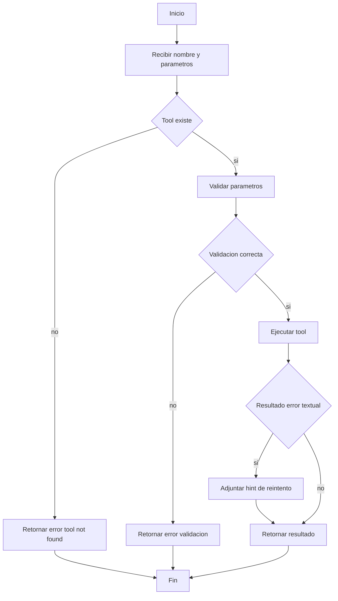
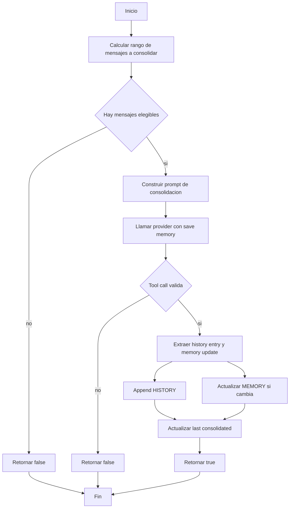
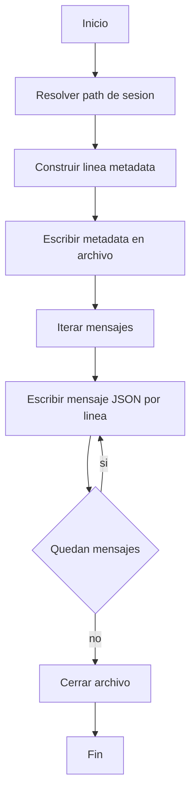

# Diagramas de Actividad UML

Diagramas de actividad para procesos principales del runtime.

---

## 1) Actividad Procesar mensaje en AgentLoop

## 2) Actividad Ejecutar tool call en ToolRegistry

## 3) Actividad Consolidar memoria

## 4) Actividad Persistir sesion JSONL

