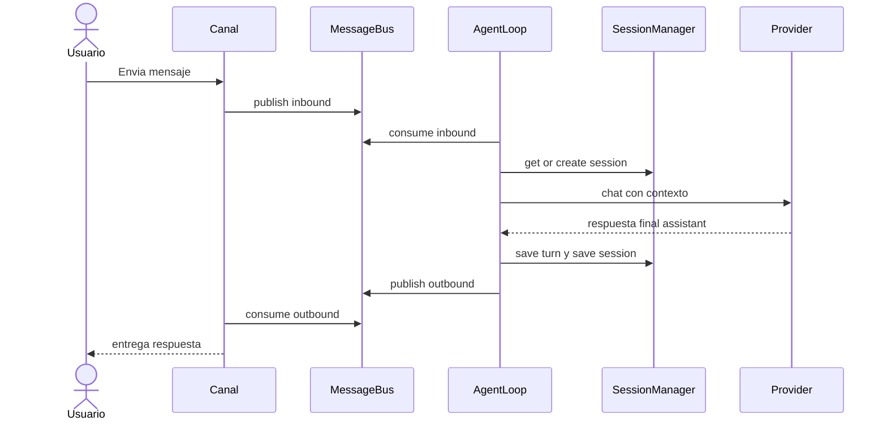
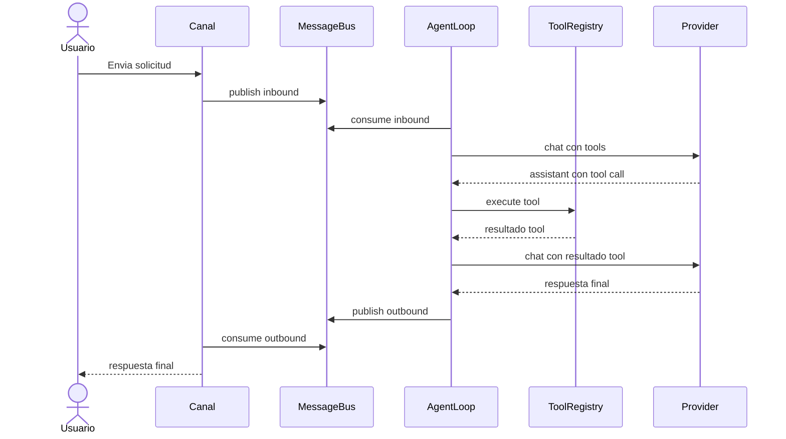
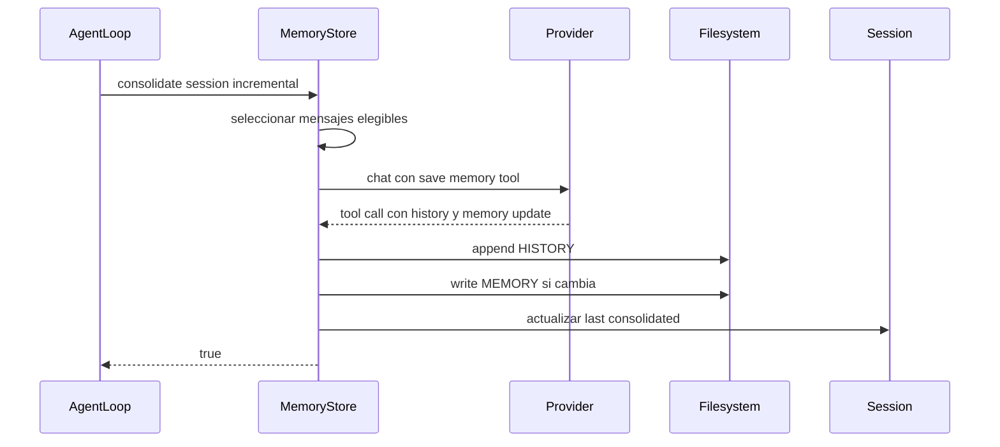
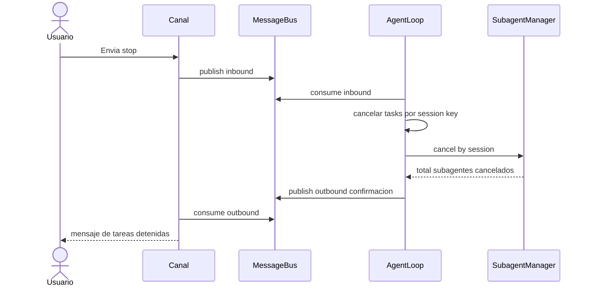

# Diagramas de Secuencia Happy Path

Secuencias principales en camino feliz para operación normal.

---

## 1) Happy path Mensaje simple sin tools

## 2) Happy path Mensaje con tool calling

## 3) Happy path Consolidacion incremental

## 4) Happy path Comando stop

