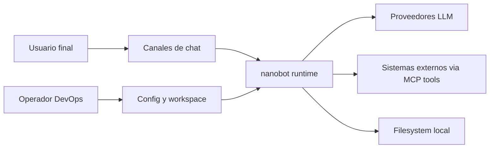
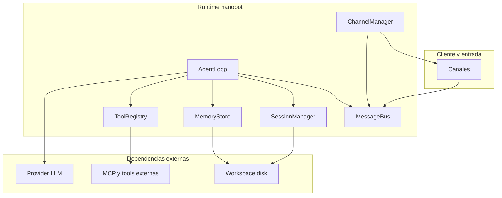
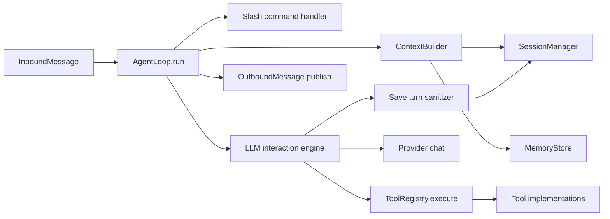

# Arquitectura C4 de nanobot

Este documento describe la arquitectura del sistema usando el framework C4 en cuatro niveles: **Contexto**, **Contenedores**, **Componentes** y **Código**.

---

## 1) Nivel C1 Contexto del Sistema

### Objetivo

Ubicar `nanobot` dentro de su ecosistema de actores y sistemas externos.



### Actores y sistemas

- **Usuario final**: envía mensajes y recibe respuestas desde un canal.
- **Canales de chat**: adaptadores como Telegram, Discord, Slack, WhatsApp, etc.
- **nanobot runtime**: orquesta sesiones, memoria, tool calling y despacho de respuestas.
- **Proveedores LLM**: servicios de inferencia usados por el agente.
- **Sistemas externos vía MCP/tools**: web, shell, filesystem, cron y otras integraciones.
- **Operador DevOps**: configura despliegue, credenciales y parámetros de ejecución.

---

## 2) Nivel C2 Contenedores

### Vista de contenedores lógicos



### Responsabilidades por contenedor

- **ChannelManager + Channels**: integra plataformas y transforma eventos a `InboundMessage` y `OutboundMessage`.
- **MessageBus**: desacopla entrada y salida mediante colas asíncronas.
- **AgentLoop**: núcleo de orquestación del ciclo de vida de mensajes.
- **SessionManager**: persistencia y recuperación de sesiones JSONL.
- **MemoryStore**: consolidación semántica y administración de `MEMORY.md` y `HISTORY.md`.
- **ToolRegistry**: registro, validación y ejecución de herramientas.
- **Provider LLM**: inferencia, tool calling y generación de respuestas.

---

## 3) Nivel C3 Componentes del contenedor Agent Runtime

### Componentes internos principales



### Relaciones clave

- `AgentLoop` consume mensajes del bus, resuelve sesión y decide rutas de control o conversación.
- `ContextBuilder` ensambla historial no consolidado y memoria de largo plazo.
- El motor iterativo consulta al LLM, ejecuta tools y vuelve a consultar hasta respuesta final.
- El guardado del turno sanitiza resultados antes de persistir.

---

## 4) Nivel C4 Código

### Mapeo de elementos C4 a módulos

| Nivel C4 | Elemento | Módulos relevantes |
|---|---|---|
| C1 | Sistema nanobot | `nanobot/__main__.py`, `nanobot/cli/commands.py` |
| C2 | MessageBus | `nanobot/bus/events.py`, `nanobot/bus/queue.py` |
| C2 | Channel integration | `nanobot/channels/*.py`, `nanobot/channels/manager.py` |
| C2 | Agent Runtime | `nanobot/agent/loop.py`, `nanobot/agent/context.py` |
| C2 | Session persistence | `nanobot/session/manager.py` |
| C2 | Memory management | `nanobot/agent/memory.py` |
| C2 | Tool execution | `nanobot/agent/tools/registry.py`, `nanobot/agent/tools/*.py` |
| C2 | LLM Providers | `nanobot/providers/*.py` |

### Flujo de código en camino feliz

```mermaid
sequenceDiagram
    participant CH as Channel
    participant BUS as MessageBus
    participant LOOP as AgentLoop
    participant SES as SessionManager
    participant MEM as MemoryStore
    participant PR as Provider
    participant TR as ToolRegistry

    CH->>BUS: publish inbound
    LOOP->>BUS: consume inbound
    LOOP->>SES: get or create session
    LOOP->>MEM: get memory context
    LOOP->>PR: chat with tools
    PR-->>LOOP: assistant output or tool calls
    LOOP->>TR: execute tool if needed
    TR-->>LOOP: tool result
    LOOP->>SES: save turn and save session
    LOOP->>BUS: publish outbound
    CH->>BUS: consume outbound
```

---

## Decisiones y notas de diseño C4

- La arquitectura prioriza **desacoplamiento** entre canales, orquestación y side effects.
- La persistencia de sesión y memoria usa archivos locales para simplicidad operativa.
- El modelo de tools permite extensibilidad incremental sin romper la frontera con el LLM.
- El C4 aquí es **lógico** y orientado a mantenimiento; puede adaptarse a despliegues monolíticos o distribuidos.
